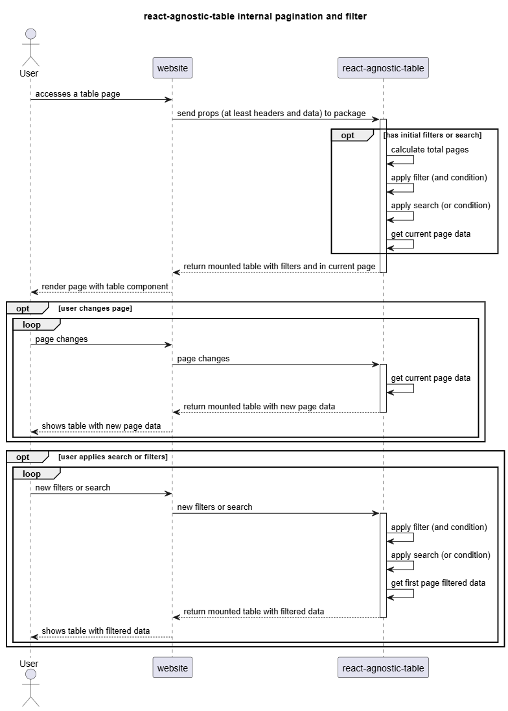
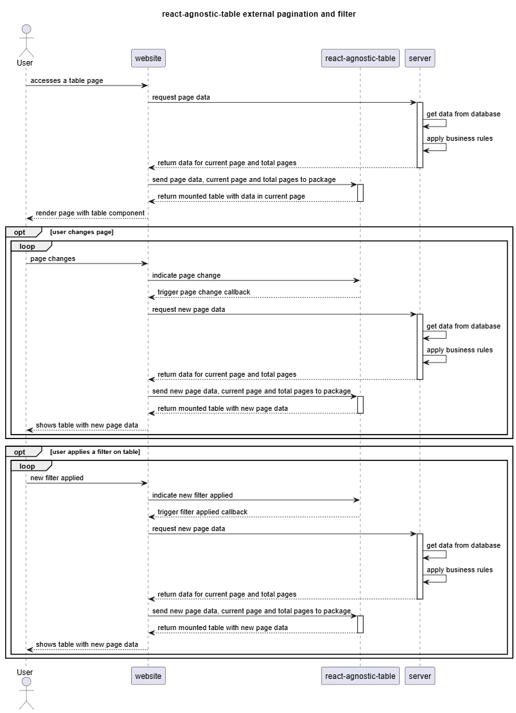

# react-agnostic-table

React Agnostic Table is an agnostic table component that can be used in a lot of different scenarios. The component allows the user to send all data and will deal with pagination, filtering and search. The component can also trigger pagination, filtering and search callbacks in case a server side data search is necessary. Every part of the table receives custom classes so the table is 100% customizable.

**Npm Package:** [react-agnostic-table - npm](https://www.npmjs.com/package/react-agnostic-table)

## Instalation

## Input Props:

| **Prop Name**        | **Prop Type**                                                                                               | **Is Mandatory** | Default Value                     | Description                                                                                                                                                                                                                                                                                                                                                                                            |
| -------------------- | ----------------------------------------------------------------------------------------------------------- | ---------------- | --------------------------------- | ------------------------------------------------------------------------------------------------------------------------------------------------------------------------------------------------------------------------------------------------------------------------------------------------------------------------------------------------------------------------------------------------------ |
| headers              | Record<string, string>                                                                                      | true             |                                   | **Headers** is a JSON object in which each object property is used to map the data associated to it. The value of the property will be used to fill the Header cell for each prop.                                                                                                                                                                                                                     |
| data                 | Record<string, number \| string \| React.ReactNode>[]                                                       | true             |                                   | **Data** is an array of JSON Objects that will be mapped according to the `header` object properties. The values can be a string, a number or a ReactNode.                                                                                                                                                                                                                                             |
| title                | string                                                                                                      | false            |                                   | **Title** is a string and will be displayed above the table when present.                                                                                                                                                                                                                                                                                                                              |
| externalPagination   | boolean                                                                                                     | false            | false                             | **ExternalPagination** indicates if the data pagination must be done by the table component or external to it. Usually external pagination is prefered, in special to perform server-side pagination.                                                                                                                                                                                                  |
| currentPage          | number                                                                                                      | false            | 1                                 | **CurrentPage** is the page to be loaded. When `externalPagination` is `false` it is used to indicate which page to load on initial rendering. When `externalPagination` is `true` it is used to indicate the current page in the bottom pagination numbers.                                                                                                                                           |
| pageSize             | number                                                                                                      | false            | 10                                | **PageSize** indicates the amount of records shown per page. It will only be considered when doing the pagination on the component side (`externalPagination: false`).                                                                                                                                                                                                                                 |
| totalPages           | number                                                                                                      | false            | Math.ceil(data.length / pageSize) | **TotalPages** indicates the total number of pages for that table data. If not sent and pagination is marked to be done by the component (`externalPagination: false`), it is calculated internally based on the `data.length` and on the `pageSize`.                                                                                                                                                  |
| onPageChangeCallback | (page: number) => void;                                                                                     | false            |                                   | **OnPageChangeCallback** is a function to deal with page change outside of the component. It receives the new page value as a param. It will also trigger on “first page”, “previous page”, “next page” and “last page” buttons, dealing with calculating the proper page to be indicated.This prop is usually used for server-side pagination.                                                        |
| isFilterable         | boolean                                                                                                     | false            | true                              | **isFilterable** indicates if the table content can be filtered or not. By indicating that it is filterable the search input and the “Filter” button shows up, otherwise they are hidden.                                                                                                                                                                                                              |
| externalFiltering    | boolean                                                                                                     | false            | false                             | **ExternalFiltering** indicates if the data filtering must be done by the table component or external to it. Usually external filtering is prefered, in special to perform server-side pagination. Filtering will only consider current received data in `data` prop.                                                                                                                                  |
| filters              | Record<string, { type: "input" \| "select" \| "checkbox" \| "date" \| "dateRange"; options?: string[]; }>[] | false            |                                   | **Filters** is an array of JSON objects that indicated the fields that can be filtered and the type of search that will be done. The avaiable filter types are “input”, “select”, “checkbox”, “date” and “dateRange”. If the filtering is done by the component the JSON prop must match the props sent in `header` prop. If done externally, the list of filters will return the same props received. |
| filtersModalPlace    | “right” \| “left” \| “center”                                                                               | false            | “left”                            | **FiltersModalPlace** indicates where the filters modal will show up. The accepted values are “left”, “right” or “center”.                                                                                                                                                                                                                                                                             |
| onSearchCallback     | (newTerm: string) => void;                                                                                  | false            |                                   | **OnSearchCallback** is a function to deal with search change outside of the component. It receives the current searchTerm being searched as a param. This prop is usually used for server-side filtering.                                                                                                                                                                                             |
| onFilterCallback     | (filters: Record<string, string \| string[]>) => void;                                                      | false            |                                   | **OnFilterCallback** is a function to deal with filter change outside of the component. It receives a JSON Object with the current filters, in which the prop is the field being searched and the value the search to be applied as a param. This prop is usually used for server-side filtering.                                                                                                      |
| containerClassNames  | string                                                                                                      | false            |                                   | **ContainerClassNames** is a string, and it’s value will be attached to the table external HTML classes in order to implement custom stylization.                                                                                                                                                                                                                                                      |
| titleClassNames      | string                                                                                                      | false            |                                   | **TitleClassNames** is a string and it’s value will be attached to the table title HTML classes in order to implement custom stylization.                                                                                                                                                                                                                                                              |

### Usage Architecture:

- Internal Pagination and Filtering

- External Pagination and Filtering

## TO-DO's:

### Known Issues to Fix:

### Future Enhancements:

- Implement an export action with exportCallback.
- Implement a general search for a specific field, adjust the searchCallback to receive the field being searched.

## Contributing

Contributions are welcome! Please open an issue or submit a pull request.

## License

MIT
