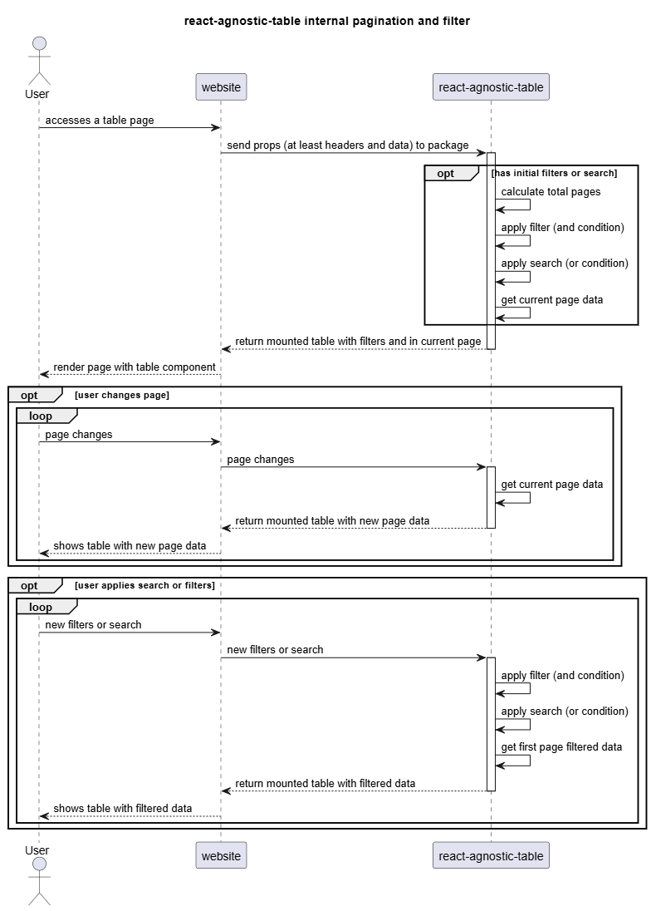
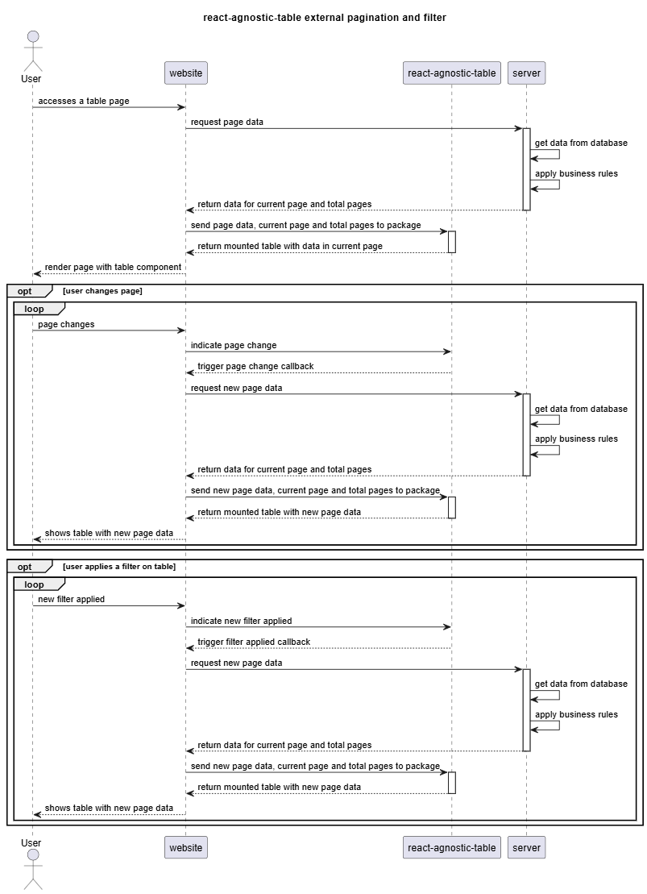

# react-agnostic-table

React Agnostic Table is an agnostic table component that can be used in a lot of different scenarios. The component allows the user to send all data and will deal with pagination, filtering and search. The component can also trigger pagination, filtering and search callbacks in case a server side data search is necessary. Every part of the table receives custom classes so the table is 100% customizable.

**Npm Package:** [react-agnostic-table - npm](https://www.npmjs.com/package/react-agnostic-table)

## Installation

Install the package from npm:

```bash
npm i react-agnostic-table
```

## Examples

Import the default `TableComponent` and pass `headers`, `data`, and any optional configs:

```tsx
import TableComponent from "react-agnostic-table";

const headers = {
  name: "Name",
  age: "Age",
  group: "Group",
  isActive: "Active",
};

const data = [
  { name: "Ana", age: 30, group: "A", isActive: "yes" },
  { name: "Carlos", age: 25, group: "B", isActive: "no" },
];

const title = "Example table";

export function ExampleTable() {
  return (
    <TableComponent
      headers={headers}
      data={data}
      title={title}
      pagination={{ location: "center" }}
      sorting={{ sortableHeaders: ["name", "age"] }}
      search={{
        show: true,
        searchableHeaders: ["name", "age"],
        searchAllFieldsLabel: "All",
      }}
      styling={{ colorPalette: "softEarth" }}
      filter={{
        show: true,
        filterableHeaders: [
          { id: "name", type: "input" },
          { id: "age", type: "input" },
          { id: "group", type: "checkbox" },
          { id: "isActive", type: "radio" },
        ],
        location: "left",
        applyFilterLabel: "Apply",
        cancelFilterLabel: "Cancel",
      }}
    />
  );
}
```

## Input Props:

`TableComponent` receives props directly.

### TableComponent root props

| Prop Name  | Prop Type                                               | Is Mandatory | Default Value | Description                                   |
| ---------- | ------------------------------------------------------- | ------------ | ------------- | --------------------------------------------- |
| headers    | `Record<string, string>`                                | true         |               | Maps each object key to a table header label. |
| data       | `Record<string, number \| string \| React.ReactNode>[]` | true         |               | Table rows. Keys should match `headers`.      |
| title      | `string`                                                | false        |               | Optional table title.                         |
| pagination | `TablePaginationConfig`                                 | false        | `{}`          | Pagination behavior and callbacks.            |
| sorting    | `TableSortingConfig`                                    | false        | `{}`          | Sorting behavior and callbacks.               |
| search     | `TableSearchConfig`                                     | false        | `{}`          | Search behavior and callbacks.                |
| filter     | `TableFilterConfig`                                     | false        | `{}`          | Filter behavior and callbacks.                |
| styling    | `TableStylingConfig`                                    | false        | `{}`          | Style and theme options.                      |

### `pagination` config (`TablePaginationConfig`)

| Field       | Type                            | Default | Description                                             |
| ----------- | ------------------------------- | ------- | ------------------------------------------------------- |
| isExternal  | `boolean`                       | `false` | Indicates if pagination state is controlled externally. |
| currentPage | `number`                        | `1`     | Current page for controlled/external pagination.        |
| pageSize    | `number`                        | `10`    | Number of rows per page.                                |
| totalPages  | `number`                        |         | Optional total pages value.                             |
| location    | `"right" \| "left" \| "center"` |         | Pagination alignment.                                   |
| onChange    | `(page: number) => void`        |         | Triggered whenever page changes.                        |

### `sorting` config (`TableSortingConfig`)

| Field           | Type                                                            | Default | Description                                    |
| --------------- | --------------------------------------------------------------- | ------- | ---------------------------------------------- |
| isExternal      | `boolean`                                                       | `false` | Indicates if sorting is controlled externally. |
| sortableHeaders | `string[]`                                                      | `[]`    | Keys that are allowed to be sorted.            |
| onSort          | `(sortKey: string, direction: "asc" \| "desc" \| null) => void` |         | Callback for sorting changes.                  |

### `search` config (`TableSearchConfig`)

| Field                | Type                                              | Default | Description                                                                   |
| -------------------- | ------------------------------------------------- | ------- | ----------------------------------------------------------------------------- |
| show                 | `boolean`                                         | `false` | Shows/hides the search input.                                                 |
| isExternal           | `boolean`                                         | `false` | Indicates if search filtering is controlled externally.                       |
| searchableHeaders    | `string[]`                                        | `[]`    | Keys that can be searched.                                                    |
| searchAllFieldsLabel | `string`                                          |         | Custom label for the "All" option in search dropdown.                         |
| onSearch             | `(searchTerm: string, searchKey: string) => void` |         | Callback with current search term and selected key (`"All"` or a header key). |

### `filter` config (`TableFilterConfig`)

| Field             | Type                                    | Default     | Description                                                                  |
| ----------------- | --------------------------------------- | ----------- | ---------------------------------------------------------------------------- |
| show              | `boolean`                               | `false`     | Shows/hides the filter trigger button.                                       |
| location          | `"right" \| "left" \| "center"`         | `"center"`  | Defines where the filter modal opens (left/right sidebar or centered modal). |
| filterableHeaders | `FilterableHeader[]`                    | `[]`        | Headers and input types available in the filter modal.                       |
| onFilter          | `(filters: ActiveTableFilters) => void` |             | Callback fired whenever applied filters change.                              |
| applyFilterLabel  | `string`                                | `"Apply"`   | Custom label for the filter apply button.                                    |
| cancelFilterLabel | `string`                                | `"Cancel"`  | Custom label for the filter cancel button.                                   |
| title             | `string`                                | `"Filters"` | Custom title shown in the filter modal.                                      |

#### `FilterableHeader`

| Field        | Type                                                       | Is Mandatory | Description                                                                                   |
| ------------ | ---------------------------------------------------------- | ------------ | --------------------------------------------------------------------------------------------- |
| id           | `string`                                                   | true         | Header key used to bind filter input to row values.                                           |
| type         | `"input" \| "checkbox" \| "radio" \| "date" \| "datetime"` | true         | Input type rendered for this header in the filter modal.                                      |
| filterValues | `string[]`                                                 | false        | Explicit options for `checkbox` and `radio`; if omitted, values are inferred from table data. |

### `styling` config (`TableStylingConfig`)

| Field               | Type                                       | Default     | Description                           |
| ------------------- | ------------------------------------------ | ----------- | ------------------------------------- |
| containerClassNames | `string`                                   |             | Custom class names for table wrapper. |
| titleClassNames     | `string`                                   |             | Custom class names for table title.   |
| colorPalette        | `"classic" \| "modernDark" \| "softEarth"` | `"classic"` | Built-in table color palette.         |

## Exports

This library exports:

- Default export: `TableComponent`
- Named export: `PaginationComponent`
- Named export: `SearchComponent`
- Named export: `FilterComponent`

```typescript
import TableComponent, {
  PaginationComponent,
  SearchComponent,
  FilterComponent,
} from "react-agnostic-table";
```

### Usage Architecture:

- Internal Pagination and Filtering



- External Pagination and Filtering



## TO-DO's:

### Known Issues to Fix:

### Future Enhancements:

- Implement an export action with exportCallback.

## Contributing

Contributions are welcome! Please open an issue or submit a pull request.

## License

MIT
